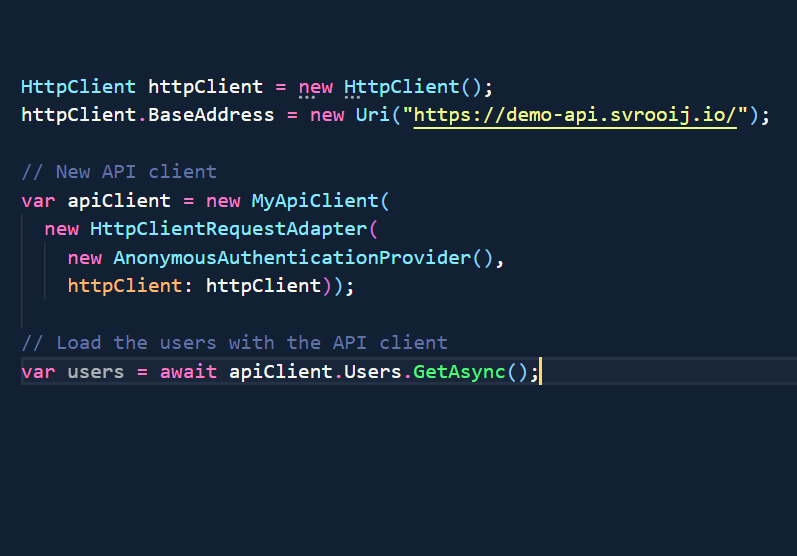
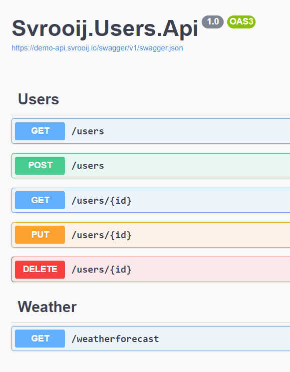

## Stephan van Rooij

Microsoft MVP
Security
M365 Development


---

## "Graph like" client for your own API


---



---

## Awesome user api

github.com/svrooij/demo-api



---

## Generate a client

```script
dotnet kiota generate -l CSharp `
 -c MyApiClient `
 -n Svrooij.Users.Client `
 -d https://demo-api.svrooij.io/swagger/v1/swagger.json `
 -o Generated
```

---

## Call the API

---

## Generate at build

```xml
  <Target Name="GenerateRestClient" DependsOnTargets="CleanGenerateRestClient;AutoGenerateRestClient" />
  <Target Name="CleanGenerateRestClient" AfterTargets="CoreClean">
    <RemoveDir Directories="Generated" />
  </Target>

  <Target Name="AutoGenerateRestClient" BeforeTargets="CollectPackageReferences"
  Outputs="Generated/MyApiClient.cs" DependsOnTargets="RestoreTools">
    <Exec Command="dotnet kiota generate -l CSharp -c MyApiClient -n Svrooij.Users.Client
  -d https://demo-api.svrooij.io/swagger/v1/swagger.json -o Generated"
    Condition="!Exists('./Generated/MyApiClient.cs')" />
    <OnError ExecuteTargets="ClientGenerationError" />
  </Target>

  <Target Name="ClientGenerationError">
    <Error Text="MyApiClient could not be generated" />
  </Target>
```

---

## Summary

Use Kiota to quickly generate a client for your own api that looks like the Microsoft Graph client


---

#### Stephan van Rooij

@svrooij
Github / Twitter

https://slides.svrooij.io/2024-11-07-m365-community-call/


