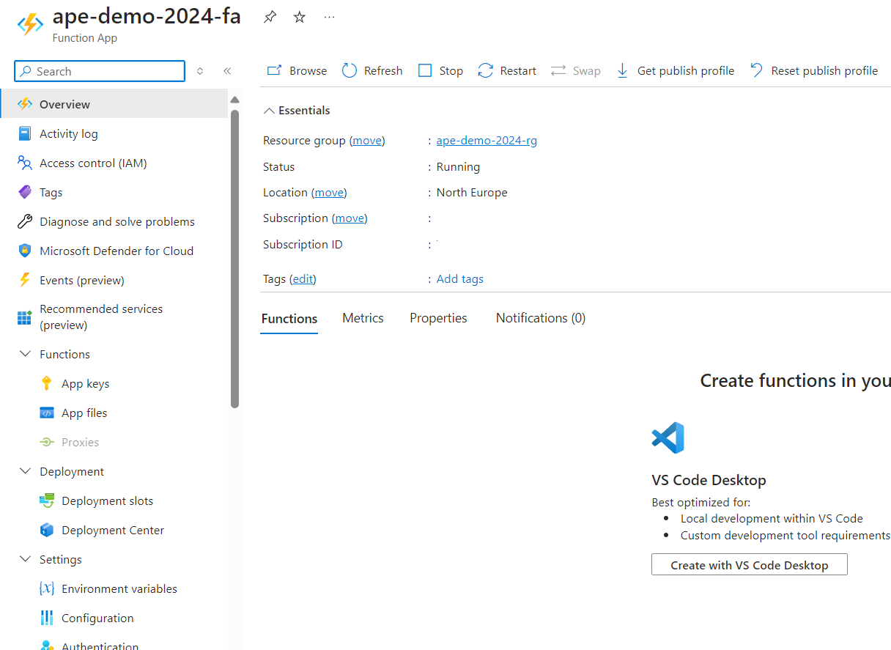
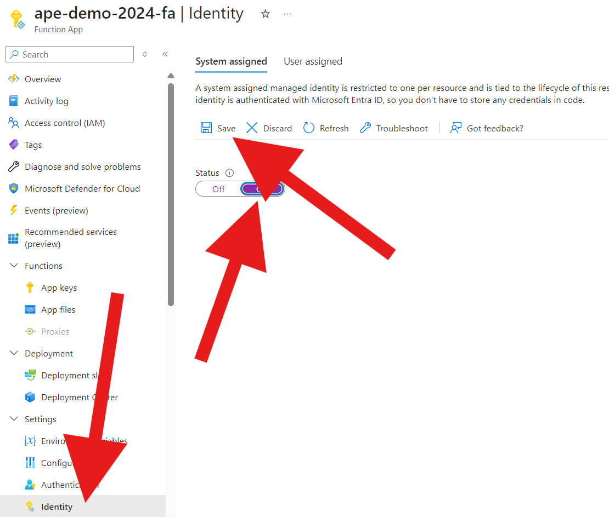
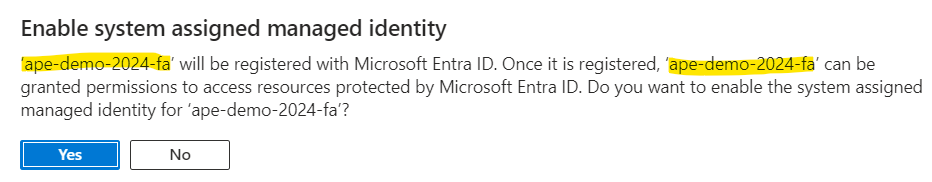
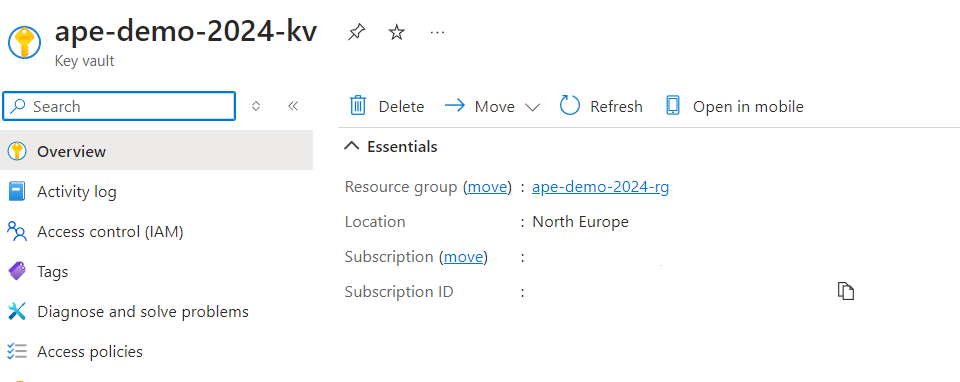
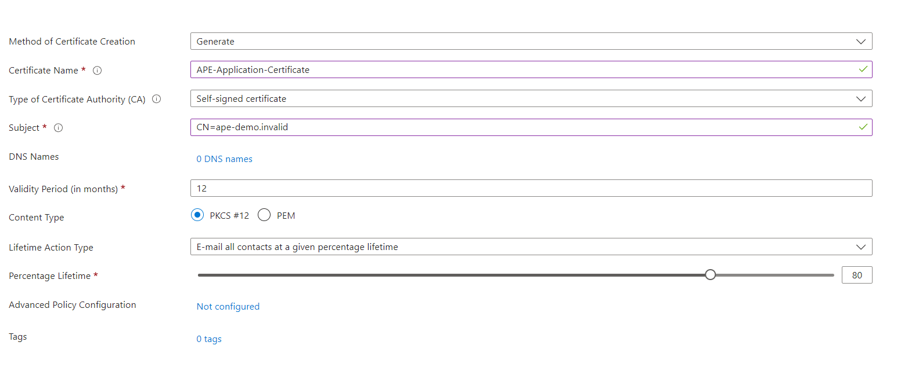
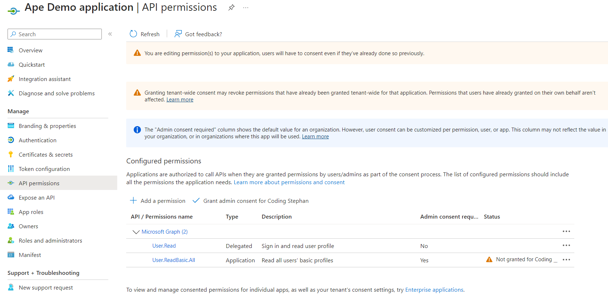
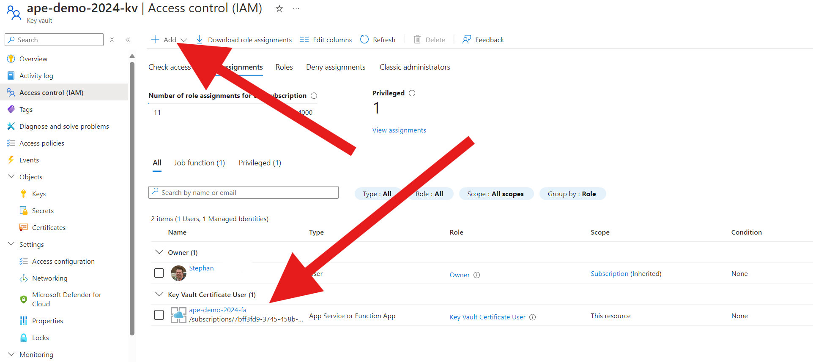
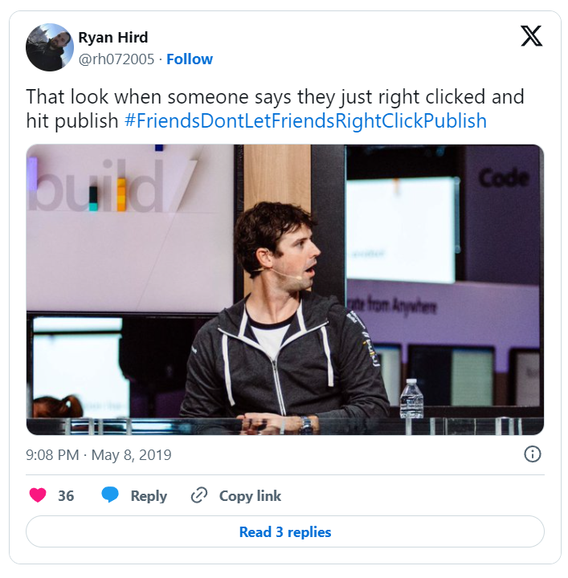

## Stephan van Rooij

Microsoft MVP
Security
M365 Development

---

## Secrets safe in KeyVault?

* Azure Functions App
  with managed identity
* Azure KeyVault
* Multi-tenant application

---

## Azure Functions

1) Pick a name
2) Choose a runtime
  `.NET`, `8 (LTS), isolated`
3) Next, next, next....
4) Enable managed identity

---

---

---

---

## Azure KeyVault

1) Create KeyVault
2) Pick name, region, pricing
3) `Azure role-based access control`
4) `All Networks` and
  `Enable public endpoint`
5) Finish

---

---

---

## Multi-tenant application

1) Register app in Azure AD
2) `Accounts in any organizational dir`
3) Add API permissions `User.Read.All`
  (Application permission for MS Graph)
4) Generate a certificate in the KeyVault
5) Download and add to the app registration

---

---

## Grant admin consent

> Thanks for noticing, I forgot to grant admin consent...

---

## Allow Functions app to access the KeyVault

1) Go to the KeyVault
2) Access Control (IAM)
3) Add role assignment
4) `Key Vault Certificate User`
5) Select the Functions app

---

---

## Deploy the app

Right-click, publish to Azure...

---

## Deploy the app 2

with CI / CD off course..
[rightclickpublish.com](https://rightclickpublish.com/)

---

## Demo 1 - Use the certificate

1) Use *managed identity* to *get* the certificate
2) Use the certificate to get a token
3) Use to token to show 3 users from MS Graph

---

## Steal certificate

1) Use *managed identity* to **get** the certificate
2) Use the certificate **with private key** to do whatever you want

---

## Demo 3 - Cloud signing

1) Prepare token request
2) [Sign](https://learn.microsoft.com/en-us/rest/api/keyvault/keys/sign/sign?view=rest-keyvault-keys-7.4&tabs=HTTP) the token request with the certificate
3) Send the token request to Entra
4) Use the token to show 3 users from MS Graph

---

## Managed identity?

* Wait, is your functions app running locally?
* How do you get the certificate?
* Show us the Access Control (IAM) in the KeyVault

---

## Takeaways

* Managed identities **need monitoring**
* Mark certificates as `non-exportable`
* Use **sign api** instead of getting the private key
* No public network, private endpoint only

---

## Questions?

---

### I'm Stephan van Rooij

@svrooij [Bluesky](https://bsky.app/profile/svrooij.bsky.social)   

Blog: [svrooij.io](https://svrooij.io)

Slides: [slides.svrooij.io](https://slides.svrooij.io/)

